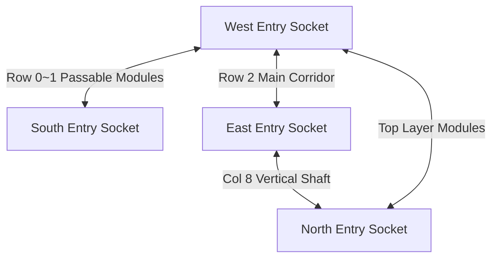

# [SubPlan] 6x6 스테이지 청크 모듈 템플릿 명세서 (6x6 Chunk Module Templates)

## 1. 개요 및 유저 확정 요구사항

본 문서는 플레이어의 정밀 물리 이동 스펙을 반영한 6x6 모듈 템플릿 및 모듈(Prefab) ➔ 청크(Prefab) 생성 주입 메커니즘을 정의합니다.
청크($60\text{m} \times 30\text{m}$)는 모듈($6\text{m} \times 6\text{m}$)의 $10 \times 5$ 배열로 구성되며, **모든 진입/진출 Entry Point(West, East, North, South Sockets) 간 최소 1개 이상의 위상적 통과 경로(Continuous Passable Pathway)**를 100% 보장합니다.

### 1.1 유저 확정 기본 지칙 (Confirmed Rules)
1. **Entry Point 간 경로 보장**: 청크 내 모든 진입/진출 Socket (West, East, North, South) 상호 간 최소 1개 이상의 도달 가능 통로(Continuous Path) 100% 보장 (BFS 그래프 검증 적용).
2. **진입/진출 Socket 위치**: 모듈/청크 간 진입·진출 위치 제한 없음 (플레이어 점프/대시 도달 가능성 검증 필수).
3. **발판 하향 통과 조작**: `OneWayPlatform` 하향 통과 조작은 **`아래 방향(Down/S Key) + 점프(Jump)`** 확정.
4. **함정 피해 & 안전 지형 이동**: 함정 피격 시 **노크백 없음 (`knockbackForce = 0`)**, 피격 직후 **가장 가까운 안전 지형(`LastSafeGroundedPosition`)으로 복귀**.
5. **그리드 셀 크기 & PPU 일치**: `Grid Cell Size = (1.0, 1.0, 1.0)`, 함정 Sprite PPU=32 (1:1 텍스처-콜라이더 정밀 결착).
6. **Entry 주변 안전 구역**: Player SpawnPoint 주변 4m 반경 내 함정/적 배치 절대 금지.

---

## 2. 플레이어 물리 이동 스펙 (Empirical Physics Specs)

| 항목 | 실측 수치 | 도약 가능 판단 기준 |
|---|---:|---|
| **이동 속도 (`Speed`)** | `6.0 m/s` | 수평 표준 이동 |
| **대시 속도 (`DodgeDashSpeed`)** | `12.0 m/s` | 무적 대시 (지속시간 `0.30s`) |
| **평지 대시 거리** | `3.6 m` | 3.6 타일 수평 이동 |
| **수직 점프 높이 (`Max Jump Height`)** | **`2.2 m ~ 2.5 m` (약 2.5 타일)** | 도달 가능 최고 높이 |
| **수평 점프 거리 (`Max Jump Range`)** | **`4.5 m` (약 4.5 타일)** | 도약 가능 최대 거리 |
| **대시 점프 거리 (`Dash Jump Range`)** | **`5.2 m ~ 5.5 m` (약 5.5 타일)** | 대시 후 최고 도약 거리 |
| **벽 점프 (`WallJumpForce`)** | `X: 9.5m/s, Y: 12.5m/s` | 벽면 반동 `3.0m` 도약 |

---

## 3. Entry Point 위상 연결 및 BFS 경로 검증 메커니즘

### 3.1 10x5 모듈 배열 통로 구성 규칙
- **West Socket (X=-30, Y=1~4)**: `ModX=0, ModY=0` 지점 전개.
- **East Socket (X=+30, Y=1~4)**: `ModX=9, ModY=0` 지점 전개.
- **South Socket (X=0, Y=0)**: `ModX=4~5, ModY=0` 지점 전개.
- **North Socket (X=0, Y=30)**: `ModX=4~5, ModY=4` 지점 전개.
- **수평 통로**: Row 0, Row 2 상에 수평 이동 가능 모듈(`Module_A1`, `Module_B1`, `Module_D1`, `Module_F1`, `Module_H1`)을 주입하여 West ↔ East 100% 직결.
- **수직 통로**: Column 4, Column 8 상에 수직 상승/하강 모듈(`Module_B1`, `Module_C1`, `Module_F3`, `Module_I1`)을 주입하여 South ↔ Middle ↔ North 100% 직결.

---

## 4. 6x6 청크 모듈 템플릿 (24종 위상 밸런스 모듈)

- **규격**: $6\text{m} \times 6\text{m}$ ($6 \times 6\text{ cells}$)
- **타일 범례**:
  - `■` : Solid Ground / Wall Tile
  - `═` : One-Way Platform (Down+Jump 하향 통과)
  - `▲` / `▼` / `◄` / `►` : Spike Trap (피격 시 가장 가까운 지형 복귀)
  - `◎` : Circular Saw Blade Trap (피격 시 가장 가까운 지형 복귀)
  - `·` : Open Air / Passable Space
  - `S` / `E` : Module Entry / Exit Socket (위치 자유)
