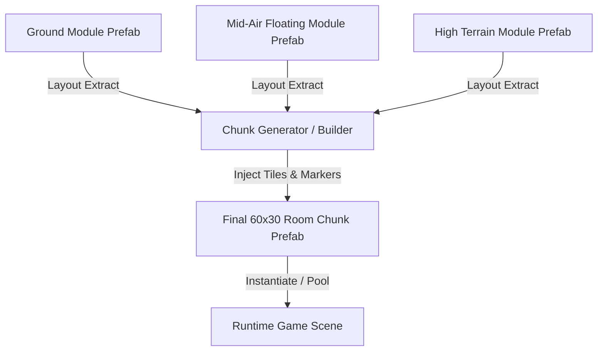

# [SubPlan] 6x6 스테이지 청크 모듈 템플릿 명세서 (6x6 Chunk Module Templates)

## 1. 개요 및 유저 확정 요구사항

본 문서는 플레이어의 정밀 물리 이동 스펙을 반영한 6x6 모듈 템플릿 및 모듈(Prefab) ➔ 청크(Prefab) 생성 주입 메커니즘을 정의합니다.
청크($60\text{m} \times 30\text{m}$)는 모듈($6\text{m} \times 6\text{m}$)의 $10 \times 5$ 배열로 구성되므로, **지면 모듈**, **공중 부유 모듈 (Mid-Air Floating Modules)**, **고지대 높은 지형 모듈 (High Terrain / Elevation Modules)**을 모두 통합 반영합니다.

### 1.1 유저 확정 5대 기본 지칙 (Confirmed Rules)
1. **진입/진출 Socket 위치**: 모듈/청크 간 진입·진출 위치 제한 없음 (플레이어 점프/대시 도달 가능성 검증 필수).
2. **발판 하향 통과 조작**: `OneWayPlatform` 하향 통과 조작은 **`아래 방향(Down/S Key) + 점프(Jump)`** 확정.
3. **함정 피해 & 안전 지형 이동**: 함정 피격 시 **노크백 없음 (`knockbackForce = 0`)**, 피격 직후 **가장 가까운 안전 지형(`LastSafeGroundedPosition`)으로 복귀**.
4. **그리드 셀 크기**: `Grid Cell Size = (1.0, 1.0, 1.0)` 기본값 고정.
5. **모듈 ➔ 청크 주입 구조**: 실제 게임 런타임에서는 모듈(Prefab) 정보를 기반으로 청크(Prefab)에 타일 및 객체 데이터를 주입하여 최종 룸 청크를 전개.

---

## 2. 플레이어 물리 이동 스펙 (Empirical Physics Specs)

| 항목 | 실측 수치 | 도약 가능 판단 기준 |
|---|---:|---|
| **이동 속도 (`Speed`)** | `6.0 m/s` | 수평 표준 이동 |
| **대시 속도 (`DodgeDashSpeed`)** | `12.0 m/s` | 무적 대시 (지속시간 `0.30s`) |
| **평지 대시 거리** | `3.6 m` | 3.6 타일 수평 이동 |
| **수직 점프 높이 (`Max Jump Height`)** | **`2.2 m ~ 2.5 m` (약 2.5 타일)** | 도달 가능 최고 높이 |
| **수평 점프 거리 (`Max Jump Range`)** | **`4.5 m` (약 4.5 타일)** | 도약 가능 최대 거리 |
| **대시 점프 거리 (`Dash Jump Range`)** | **`5.2 m ~ 5.5 m` (약 5.5 타일)** | 대시 후 최고 도약 거리 |
| **벽 점프 (`WallJumpForce`)** | `X: 9.5m/s, Y: 12.5m/s` | 벽면 반동 `3.0m` 도약 |

---

## 3. 6x6 청크 모듈 템플릿 (지상/공중/고지대 24가지 템플릿)

- **규격**: $6\text{m} \times 6\text{m}$ ($6 \times 6\text{ cells}$)
- **타일 범례**:
  - `■` : Solid Ground / Wall / High Cliff Tile
  - `═` : One-Way Platform (Down+Jump 하향 통과)
  - `▲` / `▼` / `◄` / `►` : Spike Trap (피격 시 가장 가까운 지형 복귀)
  - `◎` : Circular Saw Blade Trap (피격 시 가장 가까운 지형 복귀)
  - `·` : Open Air / Passable Space
  - `S` / `E` : Module Entry / Exit Socket (위치 자유)

---

### [Category A~E: 지상 & 장애물 통과 모듈]
```text
[Module A1: 표준 3타일 가시 건너뛰기]
· · · · · · (Y=5)
S · · · · E (Y=2)
■ ■ ▲ ▲ ▲ ■ (Y=1)
■ ■ ■ ■ ■ ■ (Y=0)
```

---

### [Category F~G: 공중 붕 떠있는 부유 모듈 (Mid-Air Floating)]
```text
[Module F1: 공중 징검다리 1-Way 발판]
· · ═ ═ · · (Y=4)
═ ═ · · ═ ═ (Y=2)
· · · · · · (Y=0) - Y=0 오픈 에어
```

---

### [Category H: 높은 지형 & 절벽 대지 모듈 (High Terrain / Elevation)]

#### Module H1: 우측 고지대 절벽 & 가시 벽 (Right High Cliff & Wall Spike)
```text
■ ■ ■ ■ ■ ■ (Y=5) - Y=3~5 고지대 암반
■ ■ ■ ■ ■ ■ (Y=4)
■ ■ ■ ■ ■ ■ (Y=3)
S · · ◄ ■ ■ (Y=2) - 좌측 저지대 ➔ 우측 3m 절벽 등반
· · · · ■ ■ (Y=1)
■ ■ ■ ■ ■ ■ (Y=0)
```

#### Module H2: 중앙 고지대 요새 대지 (Central Elevated Fortress Plateau)
```text
· · · · · · (Y=5)
· ■ ■ ■ ■ · (Y=4) - 중앙 고지대 요새 플랫폼 (Y=2~4)
· ■ ■ ■ ■ · (Y=3)
S ■ ■ ■ ■ E (Y=2) - 양측 절벽 갭
· · ▲ ▲ · · (Y=1) - 저지대 가시 골짜기
■ ■ ■ ■ ■ ■ (Y=0)
```

#### Module H3: 쌍둥이 절벽 & 고지대 공용 다리 (Dual High Cliffs & One-Way Bridge)
```text
■ ■ · · ■ ■ (Y=5)
■ ■ ═ ═ ■ ■ (Y=4) - 고지대 1-Way 공중 다리 연결
■ ■ · · ■ ■ (Y=3)
■ ■ · · ■ ■ (Y=2) - 좌/우 3m 절벽 암벽
· · · · · · (Y=1)
■ ■ ▲ ▲ ■ ■ (Y=0) - 중앙 깊은 가시 계곡
```

---

### [Category I: 고지대 경사면 & 톱날 순찰 모듈 (High Slope & Edge Patrol)]

#### Module I1: 계단식 고지대 등반 (Elevated Stepped Ledges)
```text
· · · · ■ ■ (Y=5) - 최상단 고지대
· · · ■ ■ ■ (Y=4)
· · ■ ■ ■ ■ (Y=3)
· ■ ■ ■ ■ ■ (Y=2) - 1m 피치 계단식 상승
S ■ ■ ■ ■ ■ (Y=1)
■ ■ ■ ■ ■ ■ (Y=0)
```

#### Module I2: 고지대 톱날 절벽 순찰 (High Cliff Edge Saw Patrol)
```text
· · ◎ ◄ ═ ► (Y=5) - 고지대 톱날 순찰 트랙
■ ■ ■ ■ ■ ■ (Y=4) - 고지대 암반 지형
■ ■ ■ ■ ■ ■ (Y=3)
S · · · · E (Y=2) - 하부 우회 통로
■ ▲ ▲ ▲ ▲ ■ (Y=1)
■ ■ ■ ■ ■ ■ (Y=0)
```

#### Module I3: 고지대 대시 낙하 모듈 (High Altitude Dash Drop)
```text
■ ■ ■ ■ ■ ■ (Y=5) - 고지대 지붕
S · · · · · (Y=4) - 고지대 진입
■ ■ ■ ■ · · (Y=3) - 절벽 낙하 (Drop-off 4m)
· · · · · · (Y=2)
· · · · · E (Y=1) - 저지대 출구
■ ■ ■ ■ ■ ■ (Y=0)
```

---

## 4. 모듈(Prefab) ➔ 청크(Prefab) 주입 파이프라인



1. **3대 레이어 모듈 결합**: $10 \times 5$ 그리드 상에 지상 모듈(하단), 공중 부유 모듈(중단), 고지대 절벽 모듈(상단/측면)을 무제한 조합.
2. **청크 데이터 주입**: 각 6x6 모듈 Prefab의 타일맵 및 마커 데이터를 60x30 청크 Prefab에 데이터 주입.
3. **런타임 플레이 및 도달성 검증**: 플레이어의 수직/수평 점프 동선상 도달 가능성이 100% 보장되는 완성형 청크를 런타임에 인스턴스화.
