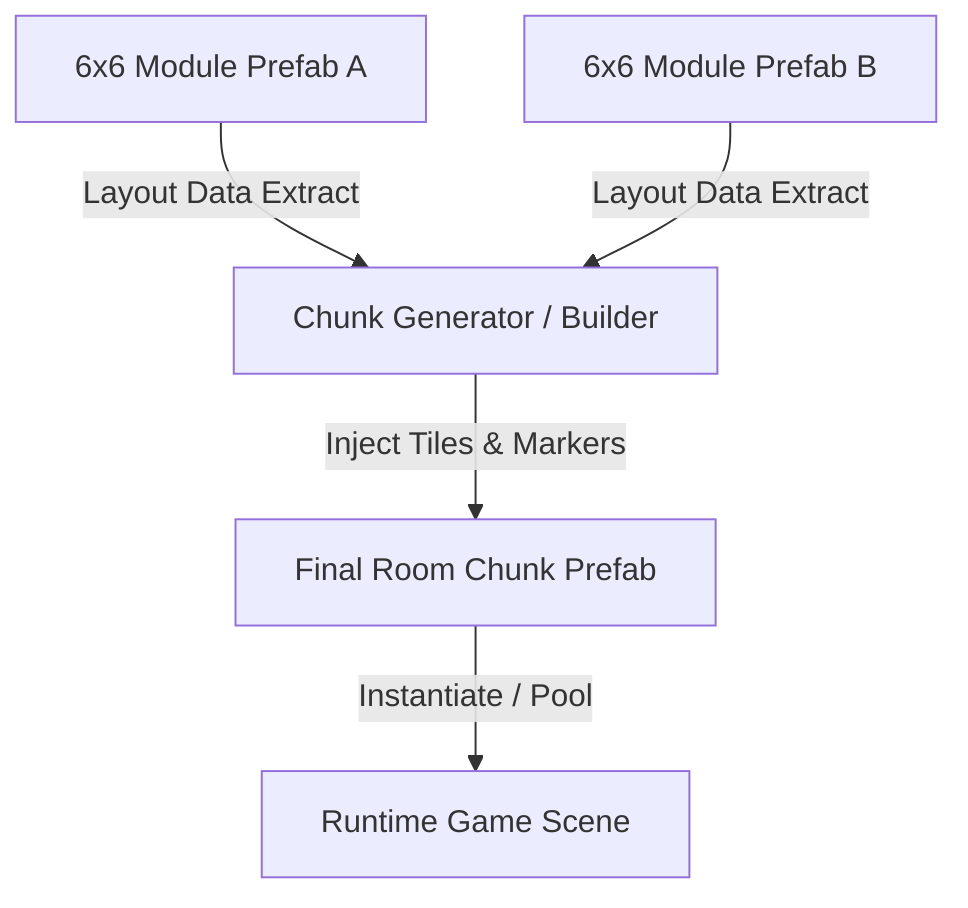

# [SubPlan] 6x6 스테이지 청크 모듈 템플릿 명세서 (6x6 Chunk Module Templates)

## 1. 개요 및 유저 확정 요구사항

본 문서는 플레이어의 정밀 물리 이동 스펙을 반영한 6x6 모듈 템플릿 및 모듈(Prefab) ➔ 청크(Prefab) 생성 주입 메커니즘을 정의합니다.

### 1.1 유저 확정 5대 기본 지칙 (Confirmed Rules)
1. **진입/진출 Socket 위치**: 모듈/청크 간 진입·진출 위치 제한 없음 (플레이어 점프/대시 도달 가능성 검증 필수).
2. **발판 하향 통과 조작**: `OneWayPlatform` 하향 통과 조작은 **`아래 방향(Down/S Key) + 점프(Jump)`** 확정.
3. **함정 피해 & 안전 지형 이동**: 함정 피격 시 **노크백 없음 (`knockbackForce = 0`)**, 피격 직후 **가장 가까운 안전 지형(`LastSafeGroundedPosition`)으로 복귀**.
4. **그리드 셀 크기**: `Grid Cell Size = (1.0, 1.0, 1.0)` 기본값 고정.
5. **모듈 ➔ 청크 주입 구조**: 실제 게임 런타임에서는 모듈(Prefab) 정보를 기반으로 청크(Prefab)에 타일 및 객체 데이터를 주입하여 최종 룸 청크를 전개.

---

## 2. 플레이어 물리 이동 스펙 (Empirical Physics Specs)

| 항목 | 실측 수치 | 도약 가능 판단 기준 |
|---|---:|---|
| **이동 속도 (`Speed`)** | `6.0 m/s` | 수평 표준 이동 |
| **대시 속도 (`DodgeDashSpeed`)** | `12.0 m/s` | 무적 대시 (지속시간 `0.30s`) |
| **평지 대시 거리** | `3.6 m` | 3.6 타일 수평 이동 |
| **수직 점프 높이 (`Max Jump Height`)** | **`2.2 m ~ 2.5 m` (약 2.5 타일)** | 도달 가능 최고 높이 |
| **수평 점프 거리 (`Max Jump Range`)** | **`4.5 m` (약 4.5 타일)** | 도약 가능 최대 거리 |
| **대시 점프 거리 (`Dash Jump Range`)** | **`5.2 m ~ 5.5 m` (약 5.5 타일)** | 대시 후 최고 도약 거리 |
| **벽 점프 (`WallJumpForce`)** | `X: 9.5m/s, Y: 12.5m/s` | 벽면 반동 `3.0m` 도약 |

---

## 3. 6x6 청크 모듈 템플릿 (12가지 템플릿)

- **규격**: $6\text{m} \times 6\text{m}$ ($6 \times 6\text{ cells}$)
- **타일 범례**:
  - `■` : Solid Ground / Wall Tile
  - `═` : One-Way Platform (Down+Jump 하향 통과)
  - `▲` / `▼` / `◄` / `►` : Spike Trap (피격 시 가장 가까운 지형 복귀)
  - `◎` : Circular Saw Blade Trap (피격 시 가장 가까운 지형 복귀)
  - `·` : Open Air / Passable Space
  - `S` / `E` : Module Entry / Exit Socket (위치 자유)

---

### 4. 모듈(Prefab) ➔ 청크(Prefab) 주입 파이프라인

1. **모듈 데이터 추출**: 6x6 Prefab 내 Tilemap, Platform, Hazard Marker 데이터 추출.
2. **청크 통합 주입**: 복수의 모듈 레이아웃을 룸 청크(Prefab)의 타일맵 및 스폰 마커 구조체로 수성/주입.
3. **런타임 룸 전개**: `StageManager` 및 `UnitSpawner`가 주입 완료된 청크 Prefab을 인스턴스화하여 게임에 배치.
