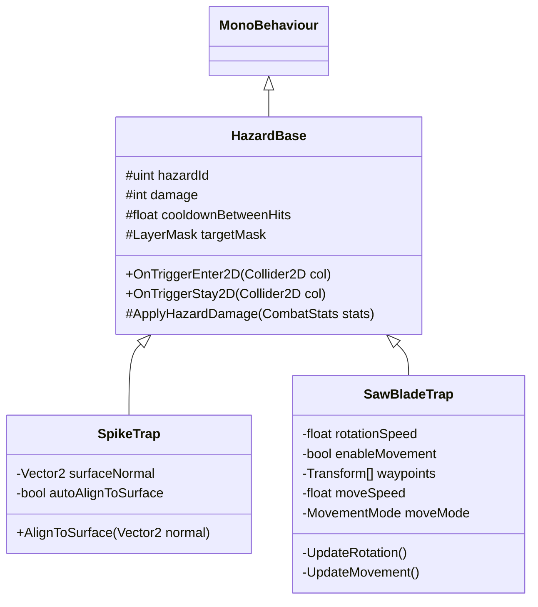

# [SubPlan] 2D 사이드뷰 함정/장애물 시스템 설계서 (Hazards & Traps)

## 1. 개요

본 서브계획서는 2D 사이드뷰 메트로배니아 환경에서 사용되는 **가시 함정 (Spike Trap)** 및 **둥근 톱날 함정 (Circular Saw Blade Trap)**의 데이터 매핑, 물리 판정, 피해 및 **안전 지형 복귀 (Safe Ground Respawn)** 라이프사이클을 규정합니다.

---

## 2. 데이터 거버넌스 및 ID 예약 (`ResourceData` / `TextData`)

모든 함정 에셋과 텍스트 식별자는 문자열 키를 절대 배제하며 `idx` 기반으로 동기화합니다.

### 2.1 `ResourceData.csv` 등록 예약
| `ResourceData.idx` | 에셋 키 | 설명 |
|---:|---|---|
| `1070` | `Hazard_SpikeTrap` | 가시 함정 프리팹 (지면/벽/천장 가변 설치) |
| `1071` | `Hazard_SawBladeTrap` | 둥근 톱날 함정 프리팹 (고정/웨이포인트 이동) |

### 2.2 `TextData.csv` 연동

- Hazard는 표시명 `TextData` FK를 사용하지 않는다.
- `2040`은 Hub Stage 1 안내, `2042`는 전투 구역 경고에 예약한다.
- 구 pair row `2041`, `2043`은 실제 참조가 없어 제거한다.

### 2.3 직렬화 기준

| Hazard | ResourceData | Damage | Knockback | Hit cooldown |
|---|---:|---:|---:|---:|
| SpikeTrap | `1070` | 15 | 0 | 0.5s |
| SawBladeTrap | `1071` | 20 | 0 | 0.4s |

---

## 3. 세부 동작 메카닉 (유저 확정 스펙)

### 3.1 노크백 없음 & 안전 지형 복귀 계약 (No Knockback & Safe Ground Teleport)
- **노크백 제거**: 함정 접촉 시 물리 밀침/노크백 효과를 적용하지 않음 (`knockbackForce = 0`).
- **안전 지형 이송**:
  - `KinematicMotor2D`는 유닛이 고체 지면(`SolidGroundLayer`) 상에 정상 착지한 시점의 위치(`LastSafeGroundedPosition`)를 지속 갱신합니다.
  - 함정에 감전/피격 시 대미지 적용 후 즉시 `motor.TeleportToSafeGround()`를 구동하여 **가장 가까운 안전 지형**으로 위치를 복귀시킵니다.
  - 연속 피격 방지를 위해 `0.5초` 피격 쿨다운(i-frame)을 유지합니다.

### 3.2 발판 하향 통과 입력 계약 (One-Way Downward Pass-Through)
- `OneWayPlatform` 발판에서 아래로 내려가는 입력 조작은 **아래 방향키/S 키 + 점프 키 (`Down + Jump`)** 조합으로 확정 구동합니다.

---

## 4. 클래스 구조

---

## 5. 검증 계획 (QA & Automated Tests)

1. **Safe Ground 복귀 테스트**: 함정 피격 시 노크백 없이 `LastSafeGroundedPosition`으로 플레이어 좌표가 올바르게 복귀하는지 NUnit PlayMode/EditMode 하네스로 검증.
2. **Downward Drop 테스트**: `Down + Jump` 조작 시 `OneWayPlatformPassThroughAsync`가 정상 실행되어 발판 아래로 착지하는지 검증.
