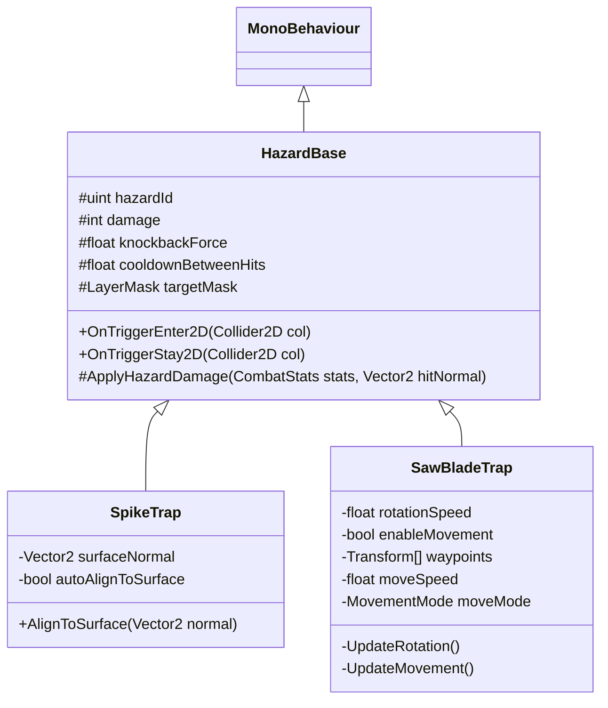

# [SubPlan] 2D 사이드뷰 함정/장애물 시스템 설계서 (Hazards & Traps)

## 1. 개요

본 서브계획서는 2D 사이드뷰 메트로배니아 환경에서 사용되는 **가시 함정 (Spike Trap)** 및 **둥근 톱날 함정 (Circular Saw Blade Trap)**의 데이터 매핑, 물리 판정, 이동 제어 및 피해 부여 라이프사이클을 규정합니다.

---

## 2. 데이터 거버넌스 및 ID 예약 (`ResourceData` / `TextData`)

모든 함정 에셋과 텍스트 식별자는 문자열 키를 절대 배제하며 `idx` 기반으로 동기화합니다.

### 2.1 `ResourceData.csv` 등록 예약
| `ResourceData.idx` | 에셋 키 | 설명 |
|---:|---|---|
| `1070` | `Hazard_SpikeTrap` | 가시 함정 프리팹 (지면/벽/천장 가변 설치) |
| `1071` | `Hazard_SawBladeTrap` | 둥근 톱날 함정 프리팹 (고정/웨이포인트 이동) |

### 2.2 `TextData.csv` 등록 예약
| `TextData.idx` | English | Korean |
|---:|---|---|
| `2040` | Spike Trap | 가시 함정 |
| `2041` | Saw Blade Trap | 톱날 함정 |

---

## 3. 함정 시스템 클래스 구조

---

## 4. 세부 동작 메카닉

### 4.1 가시 함정 (`SpikeTrap.cs`)
- **설치 유연성**: 바닥(Angle 0°), 천장(Angle 180°), 좌측 벽면(Angle -90°), 우측 벽면(Angle 90°)에 맞추어 Transform 회전 또는 RaycastSurfaceAlign으로 자동 배치.
- **피해 & 노크백**: 
  - 접촉 시 `Player` 또는 `UnitBase`의 `CombatStats`에 대미지 전달.
  - 노크백 방향은 가시가 향하는 법선 방향(`surfaceNormal`)으로 밀쳐냄.
  - 연속 피격 방지를 위해 `0.5초` 피격 쿨다운(i-frame) 보장.

### 4.2 둥근 톱날 함정 (`SawBladeTrap.cs`)
- **회전 연출**: `Z-axis` 축 지속 회전 (`rotationSpeed = 360°/s`, `Time.deltaTime`).
- **이동 옵션 (Movement Option)**:
  - `enableMovement = false`: 고정형 함정.
  - `enableMovement = true`: 지정된 Waypoint 지점($P_A \leftrightarrow P_B$) 사이를 PingPong / Loop 모드로 이동 (`moveSpeed = 3.0m/s`).
  - 이동 시 물리 충돌체 피격 틱을 안정적으로유지하기 위해 `FixedUpdate` / `Kinematic` 보정 연산 사용.

---

## 5. 검증 계획 (QA & Automated Tests)

1. **EditMode 테스트**: `HazardBase`, `SpikeTrap`, `SawBladeTrap` 컴포넌트 셋업 및 `ResourceData.idx` (1070, 1071) 매핑 검증.
2. **PlayMode 테스트**: 플레이어가 가시/톱날 함정에 접촉 시 대미지 감소, 노크백 방향 및 i-frame 정상 작동 여부 검증.
