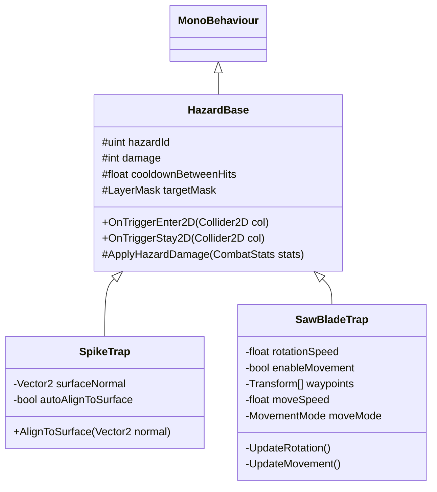

# [SubPlan] 2D 사이드뷰 함정/장애물 시스템 설계서 (Hazards & Traps)

## 1. 개요

본 서브계획서는 2D 사이드뷰 메트로배니아 환경에서 사용되는 **가시 함정 (Spike Trap)** 및 **둥근 톱날 함정 (Circular Saw Blade Trap)**의 데이터 매핑, 물리 판정, 피해 및 **안전 지형 복귀 (Safe Ground Respawn)** 라이프사이클을 규정합니다.

---

## 2. 데이터 거버넌스 및 ID 예약 (`ResourceData` / `TextData`)

모든 함정 에셋과 텍스트 식별자는 문자열 키를 절대 배제하며 `idx` 기반으로 동기화합니다.

### 2.1 기존 `ResourceData.csv` 등록 기준
| `ResourceData.idx` | 에셋 키 | 설명 |
|---:|---|---|
| `1070` | `Hazard_SpikeTrap` | 가시 함정 프리팹 (지면/벽/천장 가변 설치) |
| `1071` | `Hazard_SawBladeTrap` | 둥근 톱날 함정 프리팹 (고정/웨이포인트 이동) |

### 2.2 `TextData.csv` 연동

- Hazard는 표시명 `TextData` FK를 사용하지 않는다.
- `2040`은 Hub Stage 1 안내, `2042`는 전투 구역 경고에 예약한다.
- 구 pair row `2041`, `2043`은 실제 참조가 없어 제거한다.

### 2.3 직렬화 기준

| Hazard | ResourceData | Damage | Knockback | Hit cooldown |
|---|---:|---:|---:|---:|
| SpikeTrap | `1070` | 15 | 0 | 0.5s |
| SawBladeTrap | `1071` | 20 | 0 | 0.4s |

---

## 3. 세부 동작 메카닉 (유저 확정 스펙)

### 3.1 노크백 없음 & 안전 지형 복귀 계약 (No Knockback & Safe Ground Teleport)
- **노크백 제거**: 함정 접촉 시 물리 밀침/노크백 효과를 적용하지 않음 (`knockbackForce = 0`).
- **안전 지형 이송**:
  - `KinematicMotor2D`는 유닛이 고체 지면(`SolidGroundLayer`) 상에 정상 착지한 시점의 위치(`LastSafeGroundedPosition`)를 지속 갱신합니다.
  - 함정에 감전/피격 시 대미지 적용 후 즉시 `motor.TeleportToSafeGround()`를 구동하여 **가장 가까운 안전 지형**으로 위치를 복귀시킵니다.
  - 연속 피격 방지를 위해 표 2.3의 Hazard별 피격 쿨다운을 유지합니다.

### 3.2 발판 하향 통과 입력 계약 (One-Way Downward Pass-Through)
- `OneWayPlatform` 발판에서 아래로 내려가는 입력 조작은 **아래 방향키/S 키 + 점프 키 (`Down + Jump`)** 조합으로 확정 구동합니다.

---

## 4. 클래스 구조

---

## 5. 검증 계획 (QA & Automated Tests)

1. **Safe Ground 복귀 테스트**: 함정 피격 시 노크백 없이 `LastSafeGroundedPosition`으로 플레이어 좌표가 올바르게 복귀하는지 NUnit PlayMode/EditMode 하네스로 검증.
2. **Downward Drop 테스트**: `Down + Jump` 조작 시 `OneWayPlatformPassThroughAsync`가 정상 실행되어 발판 아래로 착지하는지 검증.

## 6. Stage 1–5 배치 승인 상한

`Stage 1=11`, `Stage 2=12`, `Stage 3=12`, `Stage 4=15`, `Stage 5=15` 청크를 기준으로 한다. 방향·이동 여부는 동일 `ResourceData.idx`의 배치 변형이며 신규 함정 종류로 세지 않는다.

| Stage | 도입 목적 | 허용 `ResourceData.idx` | 함정 보유 청크 상한 | 청크당 상한 | 스테이지 총 상한 |
|---:|---|---|---:|---:|---:|
| `1` | 전투·이동 학습 분리 | 없음 | `0/11` | `0` | `0` |
| `2` | 정지 위험물 판독 학습 | `1070` | `3/12` | `2` | `6` |
| `3` | 이동 타이밍 학습 | `1070`, 고정 `1071` | `4/12` | `2` | `8` |
| `4` | 전투·이동 복합 압박 | `1070`, 고정/이동 `1071` | `6/15` | `3` | `15` |
| `5` | 기존 두 종류의 숙련 검증 | `1070`, 고정/이동 `1071` | `7/15` | `3` | `18` |

### 6.1 청크 역할별 계약

| 역할 | 허용 | 상한·금지 |
|---|---|---|
| Entry·Rest·Reward·Portal 폐쇄 구역 | 금지 | 함정 `0`; 안전 복귀 지점으로 사용 |
| 일반·이동 | Stage 2–5 | 해당 Stage 청크당 상한 적용 |
| Combat | Stage 2–5 | Stage 2는 외곽 `1070` 최대 `1`; Stage 3–5는 중앙 전투 예약 영역 밖 최대 `2` |
| Elite | Stage 3–5 | Stage 3 최대 `2`, Stage 4–5 최대 `3` |
| Boss | Stage 4–5만 | 중앙 전투영역 `70%` 이상 무함정; 좌우 보조구역 합계 최대 `2`; Portal annex 금지 |

### 6.2 이동·안전 배치 계약

- Door는 청크 간 이동, Portal은 동일 청크 내부 폐쇄 구역 이동으로 분리하며 실제 라우팅은 `uint idx`만 사용한다.
- 모든 Door·Portal 중심에서 `7m`, Player Entry에서 `14m`, `4×4m` 전투 예약 영역 내부에는 함정을 배치하지 않는다.
- Door 간 주 경로는 무피해 왕복 가능해야 하며, 함정은 우회·선택 경로 또는 전투영역 외곽에만 둔다.
- 함정 전후에는 폭 `3m` 이상 착지면과 높이 `4m` 이상 headroom을 확보한다. OneWay 착지·하향 통과 열과 함정 사이에는 최소 `2 cell`을 둔다.
- 이동 톱날의 전체 swept bounds도 위 안전 반경과 외벽 내부 조건을 만족해야 한다.

### 6.3 생성 Assert와 완화 순서

1. `Stage 1 hazardCount == 0`; Stage별 보유 청크·청크당·총 수량은 표의 상한 이하.
2. 모든 `hazardresourceidx`는 `1070` 또는 `1071`; 문자열 런타임 키와 미등록 `idx`는 거부.
3. 동일 시드에서 위치·방향·이동 경로가 재현되고, Solid·OneWay·다른 함정 collider와 중첩하지 않음.
4. 60 FPS와 15 FPS에서 Door 간 주 경로 왕복, 안전 착지, 피격 후 `LastSafeGroundedPosition` 복귀가 모두 성공.
5. 실패 시 해당 청크의 `이동 1071 → 고정 1071 → 두 번째 이후 Combat/Elite 함정 → 선택 경로 1070` 순으로 제거한다. 안전 반경 안으로 재배치하지 않으며 주 경로가 실패하면 해당 청크 함정을 전부 제거한다.

### 🧠 [GameDesigner 자율 회고]
- 기획 무결성 비판: 이동 톱날의 swept bounds와 15 FPS 접촉 판정은 정적 배치보다 안전 반경 침범 및 연속 피격에 취약하다.
- 차기 방어 지침: Stage 4 이동 톱날을 먼저 단독 검증하고, 15 FPS 왕복·복귀 Assert 실패 시 고정 톱날로 강등한 뒤 수량 상한을 유지한다.
