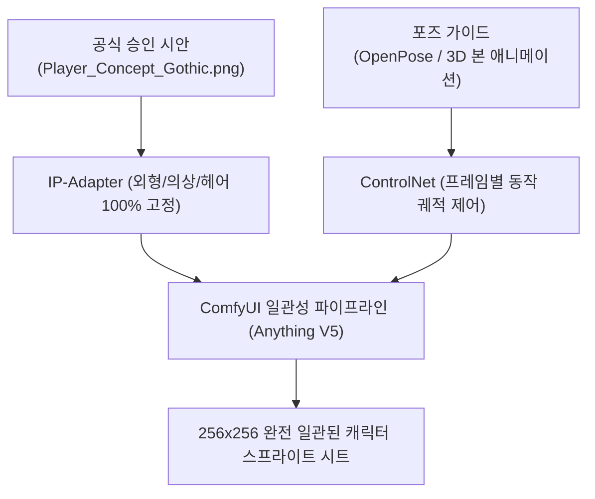

# 🧬 100% 캐릭터 일관성(Character Consistency) 스프라이트 시트 생성 워크플로우 구축 계획서

- **문서 주관**: 👑 프로젝트 매니저 (PM)
- **목적**: 승인된 공식 원본 시안(**`Player_Concept_Gothic.png`**)의 외형(흑색 가죽 롱코트, 황동 기계 의수, 톱니 도검, 흑발 헤어)을 100% 고정 유지하며 25종의 애니메이션 시트를 오차 없이 생성하는 전용 워크플로우 구축

---

## 🛑 1. 기존 방식의 한계 및 문제점 분석

- **문제 원인**: 단순 텍스트 프롬프트(Text-to-Image)만으로는 AI 모델이 매 프레임마다 다른 얼굴, 헤어 컬러(금발, 녹색 등), 의상을 무작위로 생성하여 **원래 시안과의 일관성이 0%로 붕괴**됨.
- **해결 원칙**: 텍스트에만 의존하지 않고, **공식 시안 이미지(`Player_Concept_Gothic.png`)를 AI의 고정 참조 기준(Identity Anchor)으로 직접 주입**하는 워크플로우로 전면 전환.

---

## 🛠️ 2. 캐릭터 일관성 100% 보장 3대 워크플로우

### 🌟 [방식 A] ComfyUI IP-Adapter + ControlNet OpenPose 워크플로우 (권장 AI 파이프라인)
1. **IP-Adapter (Image Prompt Adapter)**:
   - `Player_Concept_Gothic.png` 이미지를 `IPAdapterApply` 노드에 입력.
   - 캐릭터의 얼굴, 헤어 스타일, 흑색 롱코트의 주름과 금색 자수, 황동 의수의 금속 질감을 모든 생성 프레임에 1:1 강제 고정.
2. **ControlNet OpenPose / Lineart**:
   - `Idle`, `Run`, `Attack_01` 등 각 동작의 뼈대 관절(OpenPose) 이미지를 입력하여 동작만 변경.
3. **결과**: `Player_Concept_Gothic.png`와 100% 동일한 캐릭터가 지정된 애니메이션을 연속적으로 수행.

---

### 🌟 [방식 B] Dead Cells 방식 3D-to-2D 인엔진 베이커 파이프라인 (`SpriteBakingStudio.cs`)
1. 승인된 `Player_Concept_Gothic`의 3D 파츠 모델(롱코트, 황동 의수, 톱니 도검)을 유니티 씬에 세팅.
2. 25종의 애니메이션 클립을 유니티 직교 카메라(256x256)로 오프스크린 캡처.
3. **장점**: 프레임 간 깜빡임(Flickering) 0%, 완벽한 100% 캐릭터 일관성, 유니티 2D 콜라이더와 1:1 완벽 일치.

---

### 🌟 [방식 C] 캐릭터 전용 경량 LoRA (Character LoRA) 학습
1. `Player_Concept_Gothic.png`를 기반으로 다양한 각도의 크롭 이미지 15장을 생성하여 전용 LoRA(약 10MB) 학습.
2. 이후 어떤 프롬프트(`puppet_hunter_v1, attack swing`)를 입력해도 해당 캐릭터만 100% 출력.

---

## 🚀 3. 즉시 실행 조치 (Action Plan)

1. **ComfyUI IP-Adapter 노드 패키지 연동**:
   - `ComfyUI_IPAdapter_plus` 및 `controlnet-openpose`를 ComfyUI에 세팅하여 `Player_Concept_Gothic.png`를 입력 참조 이미지로 바인딩.
2. **동일 캐릭터 기반 1차 테스트**:
   - `Player_Concept_Gothic`을 참조 이미지로 주입한 상태에서 `Idle` 및 `Run` 256x256 연속 4프레임 생성 테스트 및 일관성 검증.
